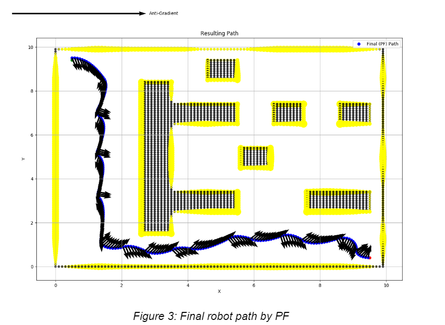

# Autonomous_Mobile_Robot_Path_Planning
Application and Comparison of Potential Fields (PF), Probabilistic Roadmap (PRM) and Rapidly Expanding Random Trees (RRT) for mobile robot path planning

All algorithms are evaluated with the same environment, with the robot’s controller for the PRM and RRT algorithms being the same, and differing for the PF algorithm. The environment is given as a Gridworld map of size 10X10 (m) and resolution 0.1 (m). Note that this environment includes obstacles. For all 3 of the problems, the following system assumptions were made:
1) The robot is a non-holonomic robot with 2 inputs (forward velocity, angular velocity) and 3 states (x position, y position, heading angle).
No slippage occurs between the robot’s wheels and the ground.
2) The time-step (dt) is infinitesimally small such that the simulation approaches the real world scenario, ie) model is sufficiently discretized (by Euler Discretization). This time-step is taken as 0.1 (s) for all simulations.
3) No motion model uncertainty exists, meaning there is no modeling of noise in the robot’s motion model.
4) Similarly, no measurement model uncertainty exists. The measurements are considered to be exactly equal to the robot’s state as well as all obstacle boundaries.
5) Markov chain assumption, meaning that the next state is only dependent on the previous state and the input.
6) The baseline of the robot is taken to be 0.45 (m) in all problems.
7) The robot is considered as a point object on the gridworld map.

## Potential Fields ##

In the PF algorithm, two kinds of potential fields are generated and summed to form a final potential field which allows the robot to navigate to its goal while avoiding obstacles. These are:
1) Attractive potential field: allows the robot to head in the direction of its goal
2) Repulsive potential field: allows the robot to avoid obstacles

In this resulting potential field, the robot moves in the direction of the anti-gradient in order to reach the lowest potential which is representative of the goal state. Note that general details surrounding the theory and formulation of the PF algorithm (not specific to this problem) are not included here (prior knowledge assumed). This is the case for all of the following algorithms. Only details specific to the implementation are provided.

Note that in the plot above, the black points represent the obstacles, the yellow points represent the detected obstacle boundaries and the blue point indicate the space of allowed motion of the robot with a reducing dot size closer to obstacle boundaries. The start (green) and end (red) points of the path are also included.

The Potential Fields algorithm varies in its means of implementation and hyperparameter tuning with the goal of generating an optimal final robot trajectory for this problem. The tuning details are as follows:
1) The hyperparameter tuning for the algorithm is notoriously tricky. To avoid arbitrarily making uninformed tuning adjustments, a combination of the attractor and repeller function to form the final potential field is plotted on a surface. By tuning the following parameters a smooth and close to ideal resulting potential field was generated by visual confirmation. The tuning parameters involved are as follows:
a) Attractor function: The gain of the pythagorean distance between the initial and goal positions. This gain is taken as a value of 10.0. The resulting attractor field equation is: 

b) Repulsive function: The gain of function in this case is taken as 2.0. The marginal distance between a point and the closest obstacle is taken as 2.0 (m). This means that the robot must be within this distance from an obstacle for it to be affected by the repulsive force of that obstacle. Finally, for the visual consistency of the surface plot, the maximum repulsive force generated is taken as 300.0. This occurs upon collision with an obstacle. The resulting repulsive function is as follows (here ‘distance’ refers to the calculated distance between the point in question and the closest point on an obstacle): 

c) The anti-gradient function: this is required to calculate the desired controller inputs for the robot to descend in the  evaluated potential surface and thus approach the goal without collisions. The gain here is taken as 1.0. The anti-gradient is calculated mathematically through an explicit equation rather than evaluated numerically over the resulting potential field. This results in the following gradient:

The negative of this function determines the vector input to the controller which determines the controller outputs.

The procedure for the implementation of the PF algorithm are as follows:
1) The algorithm is successfully completed if the robot trajectory reaches the goal position within a tolerance of 0.1 (m). The algorithm is considered to fail upon exceeding a simulation time of 100 (s), which corresponds to 1000 simulated time steps.
2) For each time step the anti-gradient of the potential function is evaluated and this is used to evaluate the outputs of the controller. These outputs are propagated through the motion model and this process is repeated in loop.
3) The controller itself has a constant forward velocity input of 1.0 (m/s). The angular velocity input is proportional to the difference between the robot’s heading and the anti-gradient vector(s) with a gain of 1.5 (chosen arbitrarily through trial and error). 

This procedure results in the final robot path shown below in Figure 3. The goal is indicated as the red point. The path of the robot is indicated as the consecutive blue points. The anti-gradient(s) are indicated as the black quivers and the obstacles and detected obstacle boundaries are indicated as the black and yellow points respectively.

As can be seen from the final trajectory of the robot, it successfully reaches the goal state without any collisions with obstacles. However, it can be noted that the continuously ‘swerving’ path of the robot is indicative of the minimum distance from the closest object to consider its repulsive force (set to 2.0 (m) here) can be reduced to result in a smoother final trajectory.

## Probabilistic Roadmap ##

The Probabilistic Roadmap algorithm is a class of geometry based planners. This is a sampling based algorithm unlike the previous PF algorithm and thus can often create trajectory plans in high-dimensional space. The algorithm simply needs to know if a single configuration/ state is in collision with an obstacle and does not attempt to construct the space explicitly. By taking samples within a space and evaluating the ‘k’ closest samples already in the space, we form collision free paths between the samples until the space is sufficiently mapped to return a valid trajectory as a sequence of poses. Note that to plot the robot motion refer to 'plot_robot_motion.py'.

Here we have multiple goal states. The states to visit that outline the overall trajectory are as follows (heading angle of the goal state is ignored as it is optional):

The PRM algorithm implemented also (as in the previous PF algorithm) includes hyperparameters that need to be tuned in order to return a close to or optimal robot trajectory efficiently (in a short computation time). The tuning of these variable algorithmic hyperparameters was done by trial and error and their resulting values are covered in the following description of the implementation. Note that for this solution, the heading angle of the goal poses are not optional and not considered. The implementation details of the algorithm are as follows:
1) We start with the initial position, and all goals as nodes within the space. 
2) While all paths are not yet found or the simulation time exceeds 100 (s) (which is equal to 1000 iterations), we continue to sample random points and evaluate the resulting edges without collisions.
3) The algorithm samples a random point within the space. Checks are done on this point to ensure that it is valid. If either check fails a new random point is sampled. If they are passed then the sample is added to the list of existing nodes:
a) The distance from the closest object is evaluated, if this distance is less then the object clearance tolerance parameter, the random sampled point is discarded (considered a collision). The object clearance tolerance parameter is set to 0.1 (m).
b) Ensuring a reasonable spread between nodes will allow the algorithm to more quickly explore the space at a cost of reduced precision. This is quantified by the node clearance parameter between the sampled point and all the existing nodes in the map. The node clearance parameter is set to 0.5 (m).
4) The ‘k’ closest nodes to this sample are evaluated. The value for k is set to the 10 closest existing nodes (chosen by trial and error, as other parameters). 
5) A collision check function ensures that the straight path from the sample to all the k nodes are collision free, if they are not then the possibility of an edge existing between them is discarded. The collision check algorithm utilizes a Bresenham’s discretization to discretize the line between the point (to the resolution of the map grid (=0.1(m))) and evaluate the distance from the closest object to that point. As previously mentioned, if this distance is less than 0.1 (m), it is considered a collision. The step-resolution of the discretization is taken to be 0.05 (m), which is purposefully set to be 4x less than the collision resolution to ensure no obstacle boundary is passed without evaluating the possibility of a collision occurring. Edges formed without collisions are added to the edge list.
6) This process of sampling random points and evaluating whether they are valid and can be added to the road map results in a growing road map (in terms of nodes and edges) that further explores the space. Upon resolving a trajectory that visits all the goal states the algorithm is concluded and the road map returned.

This results in the following map of nodes and edges:

As can be seen from Figure 4, all goal positions (red dots) are visited by the resulting node/ edge map. However, this is a very sparse map and it can be seen that very few samples were required before a trajectory was found. The resulting number of nodes and edges:

This allows a valid trajectory to be formed with only 10 nodes.

To plan an optimal trajectory, another algorithm has to be used. To do this, a linear programming technique was used from the Networkx Python package (shortest_path). This returns the shortest path in terms of the number of visited nodes. Another option would be a distance minimizing planning algorithm (such as Dijkstra’s). 

The resulting trajectory takes the form of sequence of node visitations. To execute this trajectory, the controller used takes the form of a simplistic controller. The chosen controller structure has outputs with a constant magnitude dependent on if statements to produce simple navigation between points. The tuning of the control was conducted by trial and error and resulted in the following conditions and parameters:
1) With a correct heading angle to the next node:
Forward Velocity: 0.3 (m/s) and Angular Velocity: 0.0 (rad/s). The results in the robot’s forward motion without turning.
2) With a heading angle deviating from the angle of the goal node with respect to the robot’s current position, turn in the direction of the point while slowing forward velocity:
Forward Velocity: 0.3 (m/s) and Angular Velocity: (sign) angle of goal with respect to the robot’s heading angle (rad/s) where the (sign) is determined by the smallest required turn. The results in the robot’ executing turns with a proportional gain of 5.0.

This results in a robot with a ‘tight’ turn ability (due to large proportional gain for angular velocity input). By trial and error this was seen to be preferable to avoid obstacles as the solved trajectory included maneuvers such as U-turns. The final parameter concerning the controller is the goal distance tolerance (specified in the problem statement to need a minimum value of 0.5(m)). Within 0.5 (m) of a goal point a screenshot of the robot’s cumulative path is captured. However, for more precise point following, the robot only moves on to its next objective node when reaching its previous objective node within a distance of 0.3 (m). Such a controller with the following parameters results in the cumulative trajectories below.

The blue points represent the nodes that are returned as a solution to the shortest path algorithm, the red points are the goal positions. The green points represent the robot position. All edges and obstacles are also drawn on the plot.

As can be seen above, the PRM solution successfully returns a path that traverses from the initial point through all the goal positions sequentially. However, due to the weak constraint on visiting a point being considered as reaching within 0.3 (m) of that point, there appears to be collisions due to early turning. A possible solution to this could be to increase this constraint by reducing the radius, but this is a special case as the nodes are far from each other such that the risk of overshooting is low. Also, as a result of limited samples we observe that the resolved robot trajectory includes revisiting already visited edges and nodes, resulting in an un-optimal trajectory that has a large overall travel distance. As a general rule (when convergence to a path is guaranteed ie) the desired path is possible to traverse) further exploration of the space by random samples even after the first path is found will increase the optimality of the returned trajectory (in terms of minimizing overall distance travelled to execute trajectory, as well as forming paths that more effectively return collision free trajectories). 

 ## Rapidly Exploring Random Trees ##
 
 Such as PRM, Rapidly Exploring Random Trees is a sampled based algorithm that can often create trajectory plans in high-dimensional space, also, the algorithm simply needs to know if a single configuration/ state is in collision with an obstacle and does not attempt to construct the space explicitly. In this problem, a combination of paths formed from single-query solutions between start and end points was used to form the final trajectory. Although this may be greedy, it has an advantage of requiring less samples than a multiple-query solution. However, for large spaces and a large number of goal positions, single-query RRT algorithms can suffer in increased computational time due to the large number of samples required for trees (one tree from the start position and one from the goal position; for each start and goal position in the overall path) to ‘find’ each other with a lack of shared knowledge between trees of the already explored space (more in later discussion).

The single-query RRT algorithm involves forming 2 trees at the start and goal positions. Each tree is ‘grown’ by generating a random sample in the space and interpolating between this random sample and the closest node on the tree to form a new node a set distance (a constant ‘branch’ distance) from the found closest node. We will refer to this new node as a leaf. If no collisions exist at the leaf or along the branch to the leaf the node (leaf) and edge (branch) are both added to the graphical structure of the tree. This process is repeated to grow both trees until their nodes ‘meet’ (within a tolerance) and the trees can be merged to form a network connecting the start and goal positions. A path planning algorithm (such as Dijkstra’s) can then be utilized to form a path between these positions as a trajectory represented as a sequence of nodes/ leaves.

To visualize this procedure, we can refer to the following figure which illustrates the progression of multiple single-query RRT algorithms (before any individual paths are resolved). As can be seen from Figure 6, multiple single-queries are being evaluated. This figure is for illustrative purposes only. The legend for this is as follows:
Blue edges: this single RRT query consists of 2 trees attempting to ‘find’/’meet’ each other to form a collision free path between the initial point and position 1 (for coordinates refer to Table 1).
Green edges: this single RRT query consists of 2 trees attempting to ‘find’/’meet’ each other to form a collision free path between the position 1 and position 2.
Red edges: this single RRT query consists of 2 trees attempting to ‘find’/’meet’ each other to form a collision free path between the position 2 and position 3.
Orange edges: this single RRT query consists of 2 trees attempting to ‘find’/’meet’ each other to form a collision free path between the position 3 and position 4 (the final position).

The RRT single-query algorithm(s) implemented also (as in the previous PRM and PF algorithms) includes hyperparameters that need to be tuned in order to converge to the optimal robot trajectory efficiently (low time for computation). The tuning of these variable algorithmic hyperparameters was done by trial and error and their resulting values are covered in the following description of the implementation. Note that for this solution (as in the previous for PRM), the heading angle of the goal poses are not optional and not considered. The implementation details of the algorithm are as follows:
1) For this implementation, networkx graph structures were used to represent trees. This was done for increased simplicity and reduced memory usage (instead of using multiple variable length arrays for each branch)
2) As in PRM, we start with the initial position, and all goals as nodes within the space. A separate graph structure is created at each of these positions for each single-query (paths 1 through 4). Note we shall refer to the starting node of a tree/ graph structure as its ‘root’. Thus the graph/ tree structures and their goals are:
Tree 1: for path 1: root at initial position and connect to tree 2 rooted at position 1
Tree 2: for path 1: root at position 1 and connect to tree 1 rooted at initial position
Tree 3: for path 2: root at position 1 and connect to tree 4 rooted at position 2
Tree 4: for path 2: root at position 2 and connect to tree 3 rooted at position 1
Tree 5: for path 3: root at position 2 and connect to tree 6 rooted at position 3
Tree 6: for path 3: root at position 3 and connect to tree 5 rooted at position 2
Tree 7: for path 4: root at position 3 and connect to tree 8 rooted at position 4
Tree 8: for path 4: root at position 4 and connect to tree 7 rooted at position 3
3) While all paths are not yet found or the simulation time exceeds 100 (s) (which is equal to 1000 iterations), we continue to sample random points and evaluate the resulting edges without collisions.
Per epoch (before evaluating whether respective graphs can be connected), we sample 20 random points per respective graph/ tree pair (for a single given path)
If a path between a tree pair is found, we conclude the sampling of points for that tree pair.
4) The algorithm samples a random point within the space for each tree pair corresponding to each path. The random point is interpolated with respect to the closest node in the tree pair to be a distance less than 0.5 (m) away from it. This defines the length of each branch. The interpolation is done using another Bresenham’s type discretization of the line to interpolate along (similar to that done for the collision checks). Checks are done on this point to ensure that it is valid. If either check fails a new random point is sampled and a new branch formed for that respective tree pair. If they are passed then the sample is added as a leaf to the corresponding tree:
The distance from the closest object is evaluated, if this distance is less then the object clearance tolerance parameter, the random sampled point is discarded (considered a collision). The object clearance tolerance parameter is set to 0.1 (m).
Ensuring a reasonable spread between nodes will allow the algorithm to more quickly explore the space at a cost of reduced precision. This is quantified by the node clearance parameter between the sampled point and all the existing nodes in the map. The node clearance parameter is set to 0.3 (m).
5) The closest leaves between tree pairs are evaluated. If this distance is less than a value of 1.0 (m) then we attempt to connect the trees to form a path between their respective ‘root’ positions. If the collision check (same check as in the PRM algorithm, with the same parameters) between these points passes, merge the trees and stop sampling for their path.
6) This process of sampling multiple random points and evaluating whether they are valid leaves on their respective tree pairs enables further exploration of the space for each single-query RRT. 

As can be seen above, all goal positions (red dots) are visited by the resulting node/ edge map. However, it can be seen that the branch length (0.5 (m)) is large compared to the space. This was done to decrease time required for computation (few total number of resulting nodes), however, comes at the cost of a ‘jerky’ and erratic final trajectory (more discussion on this later). The resulting number of nodes and edges:

This allows a valid trajectory to be formed with 1396 nodes. This is far greater than the previous PRM solution (10 nodes only), but comes at a cost of increased time for computation. It should also be noted that this mapping is more ‘vast’/ spaced than that returned by PRM, meaning it would be able to adapt to new start and goal positions with less further exploration than that which would be required by the PRM solution returned. The tuning of the control was conducted by trial and error and resulted in the following conditions and parameters:
1) With a correct heading angle to the next node:
Forward Velocity: 0.3 (m/s) and Angular Velocity: 0.0 (rad/s). The results in the robot’s forward motion without turning.
2) With a heading angle deviating from the angle of the goal node with respect to the robot’s current position, turn in the direction of the point while slowing forward velocity:
Forward Velocity: 0.3 (m/s) and Angular Velocity: (sign) angle of goal with respect to the robot’s heading angle (rad/s) where the (sign) is determined by the smallest required turn. The results in the robot’ executing turns with a proportional gain of 2.0. 

The proportional angular velocity input gain was reduced (compared to that of PRM) to avoid ‘zig-zag’/ oscillating motion (as observed by trial and error). Finally, illustrating the cumulative trajectories.

The blue points represent the nodes that are returned as a solution to the shortest path algorithm, the red points are the goal positions. The green points represent the robot position. All edges and obstacles are also drawn on the plots.

As can be seen from the above generated robot path, the RRT solution successfully returns a collision free path that traverses from the initial point through all the goal positions sequentially. However, as a result of a large ‘branch’ distance the resulting trajectory (returned as a sequence of position) appears jerky. Also, due to our choice to use multiple single-query RRT’s rather than a single multiple-query RRT, there is lost information about the explored space of trees, especially ones that share the same root. This results in trees that share the same root but are evaluated separately in their respective paths re-exploring areas of the configuration space that have already been explored.
